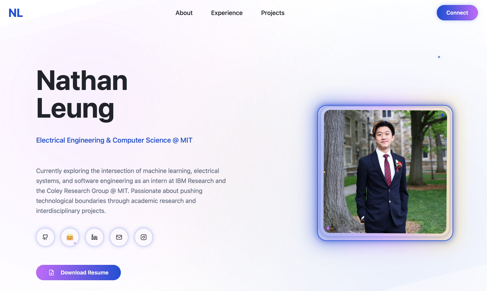

# My Personal Website

Hey! I'm Nathan Leung, an Electrical Engineering & Computer Science student at MIT.

This website showcases my tech portfolio through academic research and interdisciplinary work.



## 🎷 About This Website

This website features:
- **Hero Section**: Introduction with my background and social links
- **Experience**: Current research positions at IBM Research and MIT EECS
- **Projects**: Portfolio of my work in AI, machine learning, and software engineering
- **Connect**: Ways to get in touch with me

The site uses a modern, futuristic design with animated particles, neon effects, and a sleek, glassmorphic vibe.

## 🏒 Development

To run this website locally:

```bash
git clone https://github.com/natelgrw/natelgrw_website.git

cd natelgrw_website

npm install

npm run dev
```

## 🦫 Tech Stack

This website is built with modern web technologies that align with my software engineering background:

- **Frontend**: React 18 & TypeScript
- **Styling**: Tailwind CSS
- **UI Components**: shadcn/ui
- **Build Tool**: Vite
- **Icons**: Lucide React